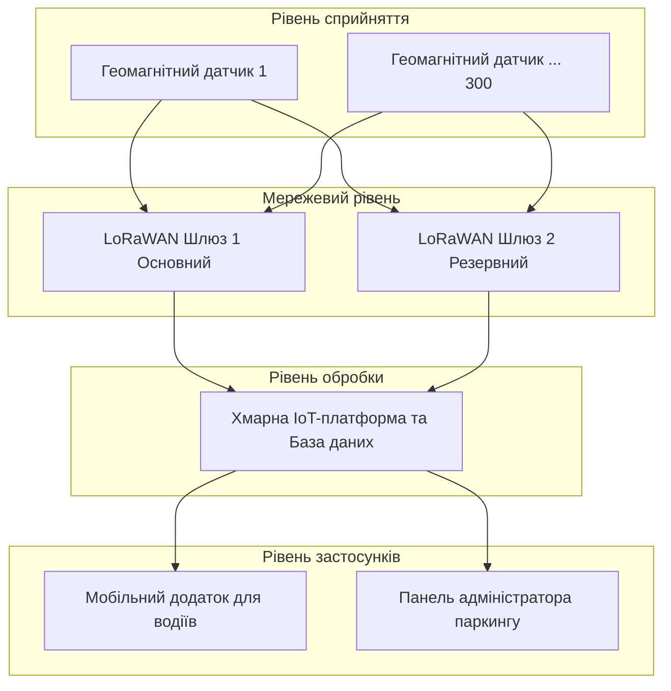

Варіант 3: Розумне паркування

1. Спосіб визначення зайнятості місця
Для визначення наявності автомобіля на паркомісці ми порівняли два типи датчиків:

Ультразвукові датчики: Вимірюють відстань до об'єкта. 
Плюси:дешеві. 
Мінуси: погано працюють на вулиці (сніг, дощ та тому подібне, можуть давати хибні спрацьовування).

Геомагнітні датчики: Реагують на зміну магнітного поля Землі через велику масу металу над ними. 
Плюси: висока точність, вмонтовуються прямо в асфальт, не бояться снігу та бруду.
Мінуси: дорогий і складний монтаж , складність заміни батарей.

3. Архітектура системи

3.1. Архітектурна діаграма

3.2. Склад системи

| Пристрій | Що вимірює, робить | Де розміщено |
| :--- | :--- | :--- |
| Геомагнітний IoT датчик | Зміну магнітного поля (наявність авто) | Вмонтовано в асфальт по центру кожного місця |
| LoRaWAN Шлюз | Збирає радіосигнали з датчиків і передає в мережу | На кришах найближчих будівель або стовбах |
| Хмарний сервер | Зберігає статус місць, обробляє запити | У хмарному дата-центрі |
| Смартфон водія | Відображає карту вільних місць | У користувача |

3.3. Обгрунтування розміщення обробки даних
Обробка даних розміщена у Хмарі.
Обґрунтування: Завдання пошуку паркомісця не є критичним до затримок. Затримка у декілька секунд між тим, як авто звільнило місце, і тим, як це відобразиться в додатку, є нормою. Тому використовувати Edge-обчислення немає потреби.

4. Безпека

Загроза: Пошкодження датчиків будь-якою технікою.
Захід протидії: Використання датчиків у міцному антивандальному корпусі та їх монтаж на рівень з асфальтом.

Загроза: Перехоплення або підміна радіосигналу від датчиків.
Захід протидії: Використання вбудованого у стандарт LoRaWAN наскрізного шифрування на рівні мережі та на рівні додатку.

Загроза: DDoS-атака на хмарний сервер, через що водії не можуть побачити вільні місця.
Захід протидії: Використання хмарних сервісів захисту від DDoS (найпопулярний це CloudFlare) та обмеження кількості запитів з однієї IP-адреси.

5. Оцінка вартості розгортання

Орієнтовний порядок величини витрат:
Бездротові геомагнітні датчики: ~6-7 тис. грн за шт. × 300 = ~2 млн. грн.
Зовнішні LoRaWAN шлюзи: ~$10-90 тис. грн за шт. × 2 = ~100 тис. грн.
Монтажні роботи: ~1 тис. грн за місце × 300 = ~300 тис. грн.
Налаштування сервера і софту (базове): ~20 тис. грн.
Загальна орієнтовна вартість розгортання: ~2.420 млн. грн.
Хмарний хостинг та мобільний зв'язок будуть відноситися до щомісячних витрат.

6. Джерела

1) ITU-T Y.2060 - Overview of the Internet of Things (Дата звернення: 11.09.2026).
2) LoRa Alliance - LoRaWAN Specification (Дата звернення: 11.09.2026).
3) https://shop-gsm.ua/catalog/shlyuzy-iot-lorawan/?srsltid=AfmBOopwC3Ka6C6eFW5aQ8WAl8aEfGZchfSbOYZX5HTc7El5_VkBPh9d (Дата звернення: 11.09.2026).
4) https://www.rabotniki.ua/uk/price/kiev (Дата звернення: 11.09.2026).
